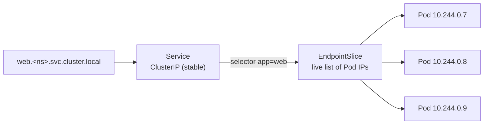

# Service

Red line 3/5 · A stable address and name in front of Pods that keep coming and
going — and the one selector bug everyone hits.

**core** · suggested Day 1 · Core track

<!--
Section S07 — Service. Timing: ~30 min slides + 30 min lab.
Outcome: learners can front a Deployment with a ClusterIP Service, explain
selector → EndpointSlice → Pod, reach it by cluster DNS, and diagnose an empty
EndpointSlice.
Beats: problem (Pod IPs are ephemeral — S06 churn proved it) · types (ClusterIP/
NodePort/LoadBalancer/ExternalName/headless) · mechanics (selector →
EndpointSlices → Pods + DNS name) · magic-move add service.yaml · service-routing
animation (US-X3, incl readiness variant → S14) · optional kube-proxy deep-dive
(off by default) · debrief to S08.
Red line: the service.yaml built here IS labs/day-1/07-service's manifest; it
selects the S06 Deployment's app: web Pods. CKx: CKAD/CKA Services & networking.
-->

---
layout: statement
kicker: The problem
---

Every rollout in Lab 06 **changed the Pod IPs.**

Pods are cattle: rescheduled, replaced, scaled — each one gets a fresh IP, and the
old one is gone for good. No client can hardcode an address that moves on every
deploy. A **Service** gives that shifting set of Pods **one stable virtual IP and
one DNS name** that never change, no matter how the Pods churn beneath it.

<!--
Speaker: this lands hardest right after S06 — they just watched the ReplicaSet
mint new Pods with new IPs during the rollout. The Service is the stable front
door; the Pods behind it are free to come and go. Lab 07 follows this section.
-->

---

<span class="kw-kicker">One resource, several reaches</span>

# Service types — pick by *who needs to reach it*

<div class="kw-cols-2 mt-3 text-sm">
  <KwCard heading="ClusterIP — the default" icon="🏠">
    A stable <strong>in-cluster</strong> virtual IP. Reachable only from inside
    the cluster. This is what Lab 07 builds, and what every other type is built
    on top of.
  </KwCard>
  <KwCard heading="NodePort" icon="🚪" variant="plain">
    ClusterIP <em>plus</em> a fixed port on <strong>every node</strong>. The
    low-level way in from outside — usually a building block, not an endpoint.
  </KwCard>
  <KwCard heading="LoadBalancer" icon="🌐" variant="plain">
    NodePort <em>plus</em> a cloud/provider external IP. The usual way to expose
    <strong>one</strong> service externally at L4.
  </KwCard>
  <KwCard heading="ExternalName" icon="🔗" variant="plain">
    No proxying — just a DNS <code>CNAME</code> to an external host. An in-cluster
    alias for something outside.
  </KwCard>
</div>

<div v-click class="mt-4 kw-muted text-sm">

**Headless** (`clusterIP: None`) is the odd one out: no virtual IP at all — DNS
returns the **Pod IPs directly**. It's how **StatefulSets (S12)** give each Pod a
stable name.

</div>

<!--
Speaker: the organizing idea is REACH, not a feature list. ClusterIP = inside;
NodePort/LoadBalancer = progressively more outside; ExternalName = pointer out;
headless = no VIP, raw Pod IPs. Note the nesting: LoadBalancer ⊃ NodePort ⊃
ClusterIP. Headless forward-links to S12 — don't over-explain it here. Lab 07 is
ClusterIP only, which works identically in namespace and kind.
-->

---

<span class="kw-kicker">Mental model</span>

# A Service is a selector — the rest is bookkeeping



<div class="kw-cols-2 mt-3 text-sm">
  <div v-click>

The Service's `selector` is a **query**. A controller runs it continuously and
writes the matching Pod IPs into **EndpointSlices** — the modern, shardable
replacement for the legacy `Endpoints` object.

  </div>
  <div v-click>

Cluster **DNS** gives the Service a name: `web.<ns>.svc.cluster.local`. Inside the
same namespace the short name `web` resolves. The name and IP are stable; the
**EndpointSlice** behind them is what changes.

  </div>
</div>

<!--
Speaker: two moving parts, stable vs live. Stable: the ClusterIP and the DNS
name. Live: the EndpointSlice, rewritten every time a Pod appears/disappears or
changes readiness. Say "EndpointSlices, not Endpoints" explicitly — Endpoints is
deprecated. The selector-is-a-query framing pays off in Step 4 of the lab where a
wrong selector silently empties the slice.
-->

---
layout: code-walkthrough
heading: 'Add a Service that selects the Deployment'
lab: labs/day-1/07-service.md
---

````md magic-move
```yaml
apiVersion: v1
kind: Service
metadata:
  name: web
```

```yaml
apiVersion: v1
kind: Service
metadata:
  name: web
  labels:
    app: web
spec:
  selector:
    app: web            # the SAME label the S06 Deployment stamps on its Pods
```

```yaml
apiVersion: v1
kind: Service
metadata:
  name: web
  labels:
    app: web
spec:
  selector:
    app: web            # picks every Pod carrying this label
  ports:
    - name: http
      port: 80          # the Service port
      targetPort: 80    # the container port (containerPort in the Pod)
```
````

<!--
Speaker: build it up: identity (name) → the wiring (selector = the Deployment's
app: web label) → the ports. Stress port vs targetPort: port is what clients hit
on the Service; targetPort is the containerPort on the Pod. They're both 80 here,
which is exactly why people conflate them — call it out. This final frame IS
labs/day-1/07-service's service.yaml, byte-for-byte; it sits BESIDE
deployment.yaml, it doesn't edit it.
-->

---

<span class="kw-kicker">The payoff · routing</span>

# Selector → EndpointSlice → Pods, live

<div class="mt-2">
  <ServiceRouting :step="$clicks" />
</div>

<div class="mt-3 text-sm">
<v-clicks at="1">

- The ClusterIP never moves; requests **load-balance** across whatever is in the slice right now.
- Fail one Pod's **readiness** and it leaves the slice while still `Running` — traffic reroutes, callers see nothing.

</v-clicks>
</div>

<!--
Speaker: this is the shared US-X3 service-routing animation, owned here and reused
by S14 for the readiness-probe story (same component, the removed Pod is the
readiness-failing one). Click through: slice populated → request fans out →
one Pod goes NotReady and drops from the slice, traffic reroutes to two. Land the
bridge: "membership in the slice = readiness, and S14 makes that a knob." The lab
proves the dark version — a wrong selector empties the slice entirely.
-->

---
showKubeProxy: false
---

<span class="kw-kicker">Optional deep-dive · off by default</span>

# How the ClusterIP actually forwards

<div v-if="$frontmatter.showKubeProxy">

<div class="kw-cols-2 mt-2 text-sm">
  <KwCard heading="kube-proxy programs the node" icon="⚙️">
    The ClusterIP is <strong>virtual</strong> — nothing listens on it. On each
    node <strong>kube-proxy</strong> watches Services + EndpointSlices and writes
    <strong>iptables</strong> (or IPVS) rules that DNAT the ClusterIP to a random
    ready Pod IP.
  </KwCard>
  <KwCard heading="iptables vs IPVS" icon="🔀" variant="plain">
    <strong>iptables</strong> mode is the common default; <strong>IPVS</strong>
    scales better for very large Service counts with real load-balancing
    algorithms. Newer clusters may run <strong>nftables</strong> mode.
  </KwCard>
</div>

<div class="mt-4 kw-muted text-sm">

So "the Service load-balances" is really **per-node packet rules**, refreshed
every time the EndpointSlice changes. No process sits in the data path.

</div>

</div>

<!--
Speaker: build/v-if toggle — set showKubeProxy: true only for an infra-curious
room; default keeps this slide collapsed to the heading so the core flow stays
tight. Mirrors S00's showRefresher pattern. The one durable takeaway if you do
show it: the ClusterIP is fiction maintained by kube-proxy as node-local rules —
that's why there's no bottleneck proxy Pod.
-->

---
layout: recap
heading: 'Debrief — stable front door, live backend'
next: 'S08 · Ingress — one L7 entry point routing by host and path'
---

- A **Service** is a stable ClusterIP + DNS name over a churning set of Pods —
  the fix for the ephemeral IPs S06 kept changing
- The `selector` is a **query**; matching Pod IPs land in an **EndpointSlice**
  (not the legacy `Endpoints`), refreshed live as Pods and readiness change
- `service.yaml` sits **beside** `deployment.yaml` and selects its `app: web`
  Pods — red line 3/5
- The classic trap: a wrong selector leaves the Service **healthy-looking but with
  zero endpoints** — when a Service "doesn't work," check its endpoints first

<!--
Speaker: the punchline for the lab is the silent failure — Service green, curl
dead, because the slice is empty. Drill the reflex: "check endpoints, not the
Service object." Then hand off: a ClusterIP is in-cluster only; reaching it from
outside by host and path with TLS is S08, Ingress. Keep service.yaml +
deployment.yaml on disk for Lab 08.
-->

---
layout: lab
lab: labs/day-1/07-service.md
duration: 30 min
env: namespace ✓ / kind ✓
---

## Lab 07 — Expose & debug routing

- Add `service.yaml` beside the Deployment; confirm a stable `ClusterIP`
- Read the **EndpointSlice** — one address per Pod; `curl http://web` by DNS from a temp Pod
- **Break the selector** to a label no Pod has → slice empties, curl times out, Service still green
- Fix the label → endpoints repopulate in a second; keep both files for Lab 08.
