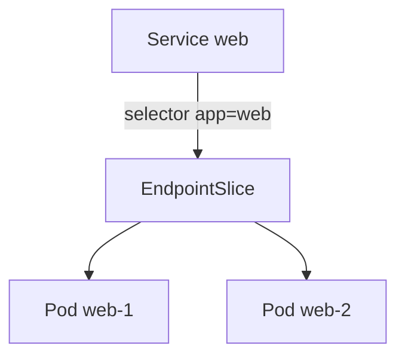
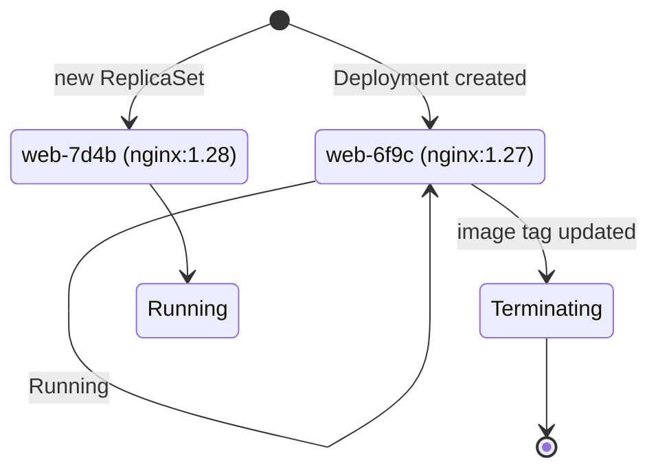

# Template gallery & animation spike

Reusable layouts, components, and the animation-technology decision for the workshop deck.

---

# What this deck is

This is **not workshop content** — it is the deck's design system, rendered as slides:

- One slide per reusable **layout**: section cover, code walkthrough, two-column
  code + diagram, lab callout, topology, recap.
- The **pod-replacement animation** ("change the image tag → the old Pod is
  replaced") implemented in four technologies, side by side.
- The **tradeoff comparison** and the approach the deck standardizes on
  (decision record: `docs/decisions/0001-animation-technology.md`).

Curriculum slides (milestone M2+) import these layouts and components.

---
layout: section-cover
image: /covers/placeholder-section.svg
day: Day 1
section: '03'
---

# Layout: `section-cover`

Divider slide with artwork slot, day/section kicker — and the mandatory `AI generated` footer whenever the artwork is AI-made.

---
layout: code-walkthrough
heading: 'Layout: code-walkthrough'
lab: labs/day-1/03-pod.md
---

````md magic-move
```yaml
apiVersion: v1
kind: Pod
metadata:
  name: web
```

```yaml
apiVersion: v1
kind: Pod
metadata:
  name: web
  labels:
    app: web
spec:
  containers:
    - name: web
      image: nginx:1.29
```

```yaml
apiVersion: v1
kind: Pod
metadata:
  name: web
  labels:
    app: web
spec:
  containers:
    - name: web
      image: nginx:1.29
      ports:
        - containerPort: 80
```
````

---
layout: two-cols-code
heading: 'Layout: two-cols-code'
lab: labs/day-1/05-service.md
---

```yaml
apiVersion: v1
kind: Service
metadata:
  name: web
spec:
  selector:
    app: web
  ports:
    - port: 80
      targetPort: 80
```

::right::



The manifest drives the diagram: code left, structure right.

---
layout: lab
lab: labs/day-1/03-pod.md
duration: 25 min
env: namespace + kind
---

## Run your first Pod

- Apply the manifest and watch it start with `kubectl get pods -w`
- Inspect it with `describe`, `logs`, and `exec`
- Break it on purpose — then read the events

---
layout: topology
heading: 'Layout: topology'
caption: Architecture boxes on a dotted canvas — used for cluster and traffic-flow diagrams.
---

<div class="flex gap-12 items-center">
  <div class="kw-panel px-6 py-4 text-center">
    <K8sIcon name="kubernetes-icon-color" size="2.2rem" />
    <div class="mt-2 font-semibold">Control plane</div>
    <div class="text-sm" style="color: var(--kw-text-dim)">API server · etcd · scheduler</div>
  </div>
  <div class="text-2xl" style="color: var(--kw-text-dim)">⇄</div>
  <div class="flex flex-col gap-3">
    <div class="kw-panel px-6 py-3">Node 1 — kubelet · runtime</div>
    <div class="kw-panel px-6 py-3">Node 2 — kubelet · runtime</div>
  </div>
</div>

---
layout: recap
heading: 'Layout: recap'
next: The animation-technology spike
---

- Six reusable layouts cover every slide shape the outline needs
- Components (`PodCard`, `LabCallout`, `K8sIcon`) are shared, not per-slide
- Official Kubernetes/CNCF artwork lives in `public/icons/`, unmodified
- AI-generated imagery always carries the `AI generated` footer

---
layout: section-cover
---

# The spike: replacing a Pod

One scene — *change the image tag, the old Pod terminates, a new Pod starts* — four technologies.

---
layout: code-walkthrough
heading: 'Variant A — pure Vue + CSS transitions'
---

<PodReplaceCss />

<div class="mt-4 text-sm" style="color: var(--kw-text-dim)">

`TransitionGroup` + CSS enter/leave/move classes. No dependency, full control, ~30 lines of CSS.

</div>

---
layout: code-walkthrough
heading: 'Variant B — @vueuse/motion'
---

<PodReplaceMotion />

<div class="mt-4 text-sm" style="color: var(--kw-text-dim)">

`v-motion` variants with spring physics. Nice easing for free — but leave animations need extra
wiring, and it adds a runtime dependency.

</div>

---
layout: two-cols-code
heading: 'Variant C — magic-move manifest + state diagram'
---

````md magic-move
```yaml
apiVersion: apps/v1
kind: Deployment
metadata:
  name: web
spec:
  replicas: 1
  template:
    spec:
      containers:
        - name: web
          image: nginx:1.27
```

```yaml
apiVersion: apps/v1
kind: Deployment
metadata:
  name: web
spec:
  replicas: 1
  template:
    spec:
      containers:
        - name: web
          image: nginx:1.28
```

```yaml
apiVersion: apps/v1
kind: Deployment
metadata:
  name: web
spec:
  replicas: 1
  template:
    spec:
      containers:
        - name: web
          image: nginx:1.28   # rolled out
```
````

::right::

<PodStateDiagram :step="$clicks" />

---
layout: two-cols-code
heading: 'Variant D — Mermaid (static baseline)'
---



::right::

Structure without motion — the reader infers the sequence. Fine as a printed
fallback; weak for teaching *when* things happen.

---

# Tradeoff comparison

| Criterion | A · Vue + CSS | B · @vueuse/motion | C · magic-move | D · Mermaid |
| --- | --- | --- | --- | --- |
| Readability presenting | ★★★ | ★★★ | ★★★ | ★ |
| Authoring effort | low–medium | medium | low | very low |
| Reusability | ★★★ components | ★★ directives | ★★★ | ★★ |
| PDF / static export | good | poor | good | ★★★ |
| Performance / deps | no deps | extra dep | built in | built in |
| Syncs with clicks | yes (`step` prop) | awkward | **natively** | n/a |

<div class="mt-5 text-sm">

**Decision:** standardize on **C + A** — `magic-move` for the manifest change, driving a
**pure Vue + CSS** state component via a click-bound `step` prop. Mermaid stays for static
structure only; `@vueuse/motion` is not adopted.
Details: `docs/decisions/0001-animation-technology.md`.

</div>

<style>
table {
  font-size: 0.72em;
}
</style>
