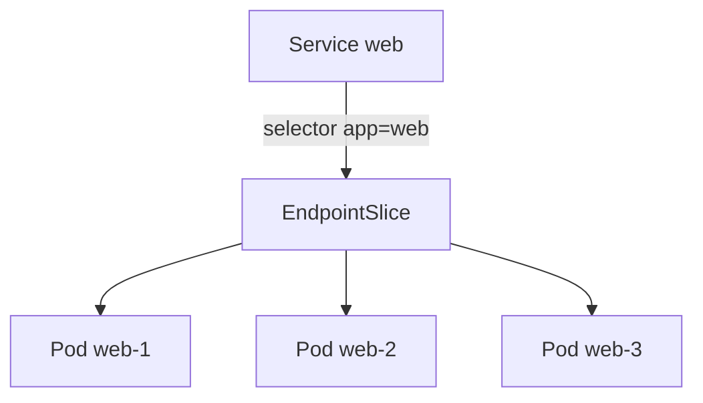
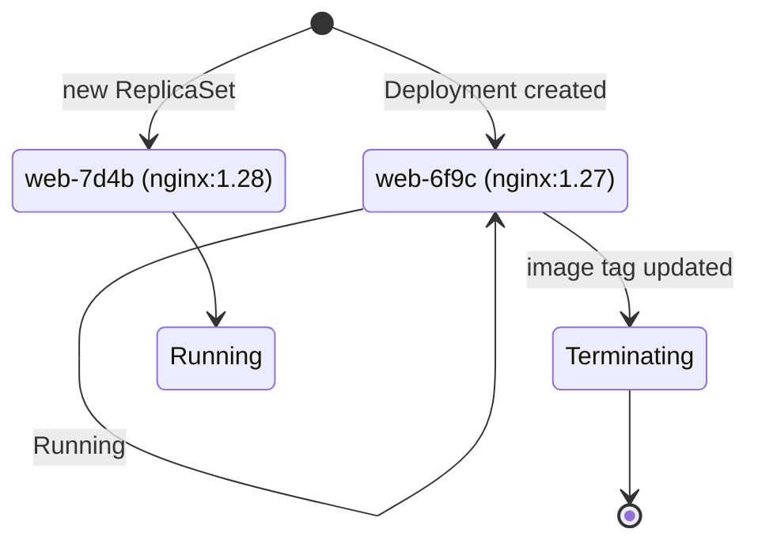

# Kubernetes Practitioner Workshop

Deck design system — master theme, reusable layouts, and the patterns every
section is built from.

<div class="flex gap-2 mt-6">
  <KwChip variant="accent">code-first</KwChip>
  <KwChip>diagrams that move</KwChip>
  <KwChip>vendor-neutral</KwChip>
  <KwChip variant="ok">open source</KwChip>
</div>

---

<span class="kw-kicker">About this deck</span>

# What this gallery is

This is **not workshop content** — it is the deck's design system, rendered as slides:

- One slide per reusable **layout** — cover, section cover, agenda, statement,
  code walkthrough, annotated code, comparison, topology, lab, recap.
- The **code-annotation patterns**: click-synced line highlights with a note
  rail, and floating overlay callouts.
- The **pod-replacement animation spike** (four technologies, one decision)
  as an appendix — decision record: `docs/decisions/0001-animation-technology.md`.

Curriculum sections (`pages/SNN-topic/`) import these layouts and components —
never re-implement a pattern per slide.

---
layout: statement
kicker: 'Layout: statement — one big idea per slide'
---

Kubernetes is a control loop: you declare **desired state**, controllers work
to make **observed state** match it.

Everything in this workshop — Deployments, Services, operators, GitOps — is
this one sentence wearing different YAML.

---
layout: agenda
heading: Day 1 — foundations and the red line
kicker: 'Layout: agenda'
---

- **Containers** — images, layers, runtimes <em>· 45 min</em>
- **Mental model** — control plane, nodes, reconciliation <em>· 30 min</em>
- **kubectl fluency** — get, describe, explain, apply <em>· 30 min</em>
- **Pods** 📦 — the smallest deployable unit <em>· 30 min</em>
- **Deployments** — desired state & rolling updates <em>· 40 min</em>
- **Services** — stable addressing for moving Pods <em>· 35 min</em>
- **Ingress** — HTTP from outside the cluster <em>· 30 min</em>
- **Labs after every block** 🧪 — ~50% of the day <em>· hands-on</em>

---
layout: section-cover
image: /covers/placeholder-section.svg
day: Day 1
section: '05'
---

# Pods

The smallest deployable unit — and the layout every section opens with.

---

<span class="kw-kicker">Layout: default + KwCard grid</span>

# The cluster in three planes

<div class="kw-cols-3 mt-4">
  <v-click at="1">
    <KwCard heading="Control plane" icon="🧠">
      <strong>Decides.</strong> API server, etcd, scheduler, controller
      manager — holds desired state and plans the next move.
    </KwCard>
  </v-click>
  <v-click at="2">
    <KwCard heading="Worker nodes" icon="⚙️">
      <strong>Run.</strong> kubelet, kube-proxy, container runtime — turn the
      plan into running containers.
    </KwCard>
  </v-click>
  <v-click at="3">
    <KwCard heading="Add-ons" icon="🔌" variant="plain">
      <strong>Extend.</strong> DNS, ingress controller, metrics, CNI — the
      cluster's standard library.
    </KwCard>
  </v-click>
</div>

<div v-click="4" class="mt-6 kw-muted text-sm">

The rest of Day 1 walks *down* this picture: we talk to the API server with
`kubectl`, and watch nodes do the work.

</div>

---
layout: code-walkthrough
heading: From Pod to Deployment — the manifest grows
lab: labs/day-1/06-deployment.md
---

````md magic-move
```yaml
apiVersion: v1
kind: Pod
metadata:
  name: web
  labels:
    app: web
spec:
  containers:
    - name: web
      image: nginx:1.29
```

```yaml
apiVersion: apps/v1
kind: Deployment
metadata:
  name: web
spec:
  selector:
    matchLabels:
      app: web
  template:
    metadata:
      labels:
        app: web
    spec:
      containers:
        - name: web
          image: nginx:1.29
```

```yaml
apiVersion: apps/v1
kind: Deployment
metadata:
  name: web
spec:
  replicas: 3
  strategy:
    type: RollingUpdate
    rollingUpdate:
      maxUnavailable: 1
  selector:
    matchLabels:
      app: web
  template:
    metadata:
      labels:
        app: web
    spec:
      containers:
        - name: web
          image: nginx:1.29
```
````

---
layout: code-annotated
heading: 'Service: how traffic finds Pods'
lab: labs/day-1/07-service.md
---

```yaml {none|6-7|8-11|8-11}
apiVersion: v1
kind: Service
metadata:
  name: web
spec:
  selector:
    app: web
  ports:
    - name: http
      port: 80
      targetPort: 8080
```

::notes::

<CodeNote at="1" label="spec.selector">
The Service tracks <strong>every Pod whose labels match</strong> — not a fixed
list of IPs. Pods come and go; the selector keeps up.
</CodeNote>

<CodeNote at="2" label="port vs targetPort">
Clients hit the Service on <strong>80</strong>; the container listens on
<strong>8080</strong>. Two different network hops, two different numbers.
</CodeNote>

<CodeNote at="3" label="gotcha" variant="warn">
If <code>targetPort</code> doesn't match a real container port, endpoints
stay empty and traffic silently blackholes. Lab 07 breaks this on purpose.
</CodeNote>

---
layout: code-walkthrough
heading: Spot the risky Pod spec
---

<div style="width: 60%">

```yaml
apiVersion: v1
kind: Pod
metadata:
  name: worker
spec:
  containers:
    - name: worker
      image: registry.example.com/worker:latest
      securityContext:
        privileged: true
      resources: {}
```

</div>

<CodeCallout at="1" top="30%" right="4%" width="17rem" label="image: …:latest" variant="warn">
Not a version. Tomorrow's <strong>latest</strong> is a different image —
rollbacks become guesswork. Pin a tag or digest.
</CodeCallout>

<CodeCallout at="2" top="52%" right="4%" width="17rem" label="privileged: true" variant="danger">
Full access to the node's devices and kernel — one bad day from a
<strong>container escape</strong>. Day 3 shows the exploit, then the fix.
</CodeCallout>

<CodeCallout at="3" top="74%" right="4%" width="17rem" label="resources: {}" variant="warn">
No requests, no limits: the scheduler flies blind and the kernel picks the
OOM victim for you.
</CodeCallout>

---
layout: code-annotated
heading: Rolling update, from the CLI
lab: labs/day-1/06-deployment.md
---

```bash {none|1|2|3-4}
kubectl set image deployment/web web=nginx:1.30
kubectl rollout status deployment/web
kubectl rollout history deployment/web
kubectl rollout undo deployment/web
```

::notes::

<CodeNote at="1" label="set image">
Edits desired state — nothing more. The Deployment controller notices the
diff and starts a new ReplicaSet.
</CodeNote>

<CodeNote at="2" label="rollout status">
Watches observed state converge: new Pods ready, old ones terminated,
respecting <code>maxUnavailable</code>.
</CodeNote>

<CodeNote at="3" label="history / undo" variant="ok">
Every rollout is kept as a revision. <strong>undo</strong> is just another
rollout — same mechanics, previous template.
</CodeNote>

---
layout: two-cols-code
heading: One Service, many Pods — manifest ↔ structure
lab: labs/day-1/07-service.md
---

```yaml
apiVersion: v1
kind: Service
metadata:
  name: web
spec:
  selector:
    app: web
  ports:
    - port: 80
      targetPort: 8080
```

::right::



The manifest drives the diagram: code left, structure right.

---
layout: comparison
heading: North-south routing, two generations
leftHeading: Ingress
rightHeading: Gateway API
leftBadge: established
rightBadge: successor
---

```yaml
apiVersion: networking.k8s.io/v1
kind: Ingress
metadata:
  name: web
spec:
  rules:
    - host: shop.example.com
      http:
        paths:
          - path: /
            pathType: Prefix
            backend:
              service:
                name: web
                port:
                  number: 80
```

::right::

```yaml
apiVersion: gateway.networking.k8s.io/v1
kind: HTTPRoute
metadata:
  name: web
spec:
  parentRefs:
    - name: shared-gateway
  hostnames: ["shop.example.com"]
  rules:
    - matches:
        - path:
            type: PathPrefix
            value: /
      backendRefs:
        - name: web
          port: 80
```

---
layout: topology
heading: Inside a cluster
caption: 'Layout: topology + ArchBox / kw-obj — boxes on a dotted canvas, revealed step by step.'
---

<div class="flex flex-col gap-4 w-full items-center">
  <ArchBox heading="Control plane" sub="kubectl talks here" variant="plane" class="w-3/4">
    <span class="kw-obj">kube-apiserver</span>
    <span class="kw-obj">etcd</span>
    <span class="kw-obj">kube-scheduler</span>
    <span class="kw-obj">controller-manager</span>
  </ArchBox>
  <div class="kw-flow-arrow">▲ desired state · observed state ▼</div>
  <div class="kw-cols-2 w-3/4">
    <v-click at="1">
      <ArchBox heading="node-1" sub="worker" variant="node">
        <span class="kw-obj kw-obj--dim">kubelet</span>
        <span class="kw-obj kw-obj--dim">kube-proxy</span>
        <span class="kw-obj kw-obj--ok">web-1 · Running</span>
        <span class="kw-obj kw-obj--ok">web-2 · Running</span>
      </ArchBox>
    </v-click>
    <v-click at="2">
      <ArchBox heading="node-2" sub="worker" variant="node">
        <span class="kw-obj kw-obj--dim">kubelet</span>
        <span class="kw-obj kw-obj--dim">kube-proxy</span>
        <span class="kw-obj kw-obj--warn">web-3 · Pending</span>
      </ArchBox>
    </v-click>
  </div>
</div>

---
layout: two-cols-code
heading: 'Behavior: change the image, watch the Pod get replaced'
lab: labs/day-1/06-deployment.md
---

<PodReplaceCss />

::right::

<div class="text-sm kw-muted">

The deck's standard for **object behavior**: a pure Vue + CSS component with a
click-bound `step` prop, next to the manifest or command that causes the
transition (ADR 0001).

Click through: the old Pod terminates, the new one starts — the animation *is*
the mental model.

</div>

---
layout: lab
lab: labs/day-1/05-pod.md
duration: 25 min
env: namespace ✓ · kind ✓
---

## Run your first Pod

- Apply the manifest and watch it start with `kubectl get pods -w`
- Inspect it with `describe`, `logs`, and `exec`
- Break it on purpose — then read the events

---
layout: recap
heading: Using the design system
next: 'Appendix — the animation-technology spike (ADR 0001)'
---

- Ten layouts cover every slide shape the outline needs — pick, don't invent
- Code teaches in steps: `magic-move` for growing manifests, `{none|…}` line
  highlights synced with `CodeNote` rails, `CodeCallout` overlays for risky specs
- One accent color points; green/amber/red mean ok/caution/broken — nothing else
- Behavior gets a Vue + CSS `step` component, structure gets static Mermaid
- AI-generated imagery always carries the `AI generated` footer

---

<span class="kw-kicker">Cheat sheet</span>

# Layouts & components at a glance

<div class="grid grid-cols-2 gap-6 mt-2">
<div>

| Layout | Use for |
| --- | --- |
| `cover` / `section-cover` | deck + section openers |
| `agenda` | day/section overview cards |
| `statement` | one big idea |
| `code-walkthrough` | full-width `magic-move` |
| `code-annotated` | code + `CodeNote` rail |
| `two-cols-code` | code ↔ diagram/animation |
| `comparison` | side-by-side manifests |
| `topology` | architecture canvas |
| `lab` / `recap` | hand-off + takeaways |

</div>
<div>

| Component | Use for |
| --- | --- |
| `CodeNote` | click-synced side annotation |
| `CodeCallout` | floating overlay on code |
| `KwCard` / `KwChip` | concept grids, tags |
| `ArchBox` + `.kw-obj` | cluster diagrams |
| `LabCallout` | lab reference chip |
| `K8sIcon` | brand logos + resource glyphs |
| `PodCard`, `PodReplaceCss` | object behavior scenes |

</div>
</div>

---
layout: section-cover
---

# Iconography — resource glyphs

<span class="kw-kicker">Sample · under review</span>

The official Kubernetes architecture-icon set, vendored and wrapped in
`K8sIcon`. Proposed for diagrams and concept slides — review the style, then
we standardize.

---

<span class="kw-kicker">Sample · the set</span>

# One glyph per resource

<div class="ic-groups">
  <div class="ic-group">
    <div class="ic-group-label">Workloads</div>
    <div class="ic-row">
      <span class="ic-tile"><K8sIcon kind="pod" size="2.4rem" /><code>pod</code></span>
      <span class="ic-tile"><K8sIcon kind="deploy" size="2.4rem" /><code>deploy</code></span>
      <span class="ic-tile"><K8sIcon kind="rs" size="2.4rem" /><code>rs</code></span>
      <span class="ic-tile"><K8sIcon kind="sts" size="2.4rem" /><code>sts</code></span>
      <span class="ic-tile"><K8sIcon kind="ds" size="2.4rem" /><code>ds</code></span>
      <span class="ic-tile"><K8sIcon kind="job" size="2.4rem" /><code>job</code></span>
      <span class="ic-tile"><K8sIcon kind="cronjob" size="2.4rem" /><code>cronjob</code></span>
      <span class="ic-tile"><K8sIcon kind="hpa" size="2.4rem" /><code>hpa</code></span>
    </div>
  </div>
  <div class="ic-group">
    <div class="ic-group-label">Networking</div>
    <div class="ic-row">
      <span class="ic-tile"><K8sIcon kind="svc" size="2.4rem" /><code>svc</code></span>
      <span class="ic-tile"><K8sIcon kind="ep" size="2.4rem" /><code>ep</code></span>
      <span class="ic-tile"><K8sIcon kind="ing" size="2.4rem" /><code>ing</code></span>
      <span class="ic-tile"><K8sIcon kind="netpol" size="2.4rem" /><code>netpol</code></span>
    </div>
  </div>
  <div class="ic-group">
    <div class="ic-group-label">Config &amp; storage</div>
    <div class="ic-row">
      <span class="ic-tile"><K8sIcon kind="cm" size="2.4rem" /><code>cm</code></span>
      <span class="ic-tile"><K8sIcon kind="secret" size="2.4rem" /><code>secret</code></span>
      <span class="ic-tile"><K8sIcon kind="pv" size="2.4rem" /><code>pv</code></span>
      <span class="ic-tile"><K8sIcon kind="pvc" size="2.4rem" /><code>pvc</code></span>
      <span class="ic-tile"><K8sIcon kind="quota" size="2.4rem" /><code>quota</code></span>
    </div>
  </div>
  <div class="ic-group">
    <div class="ic-group-label">Cluster &amp; control plane</div>
    <div class="ic-row">
      <span class="ic-tile"><K8sIcon kind="ns" size="2.4rem" /><code>ns</code></span>
      <span class="ic-tile"><K8sIcon kind="sa" size="2.4rem" /><code>sa</code></span>
      <span class="ic-tile"><K8sIcon kind="crd" size="2.4rem" /><code>crd</code></span>
      <span class="ic-tile"><K8sIcon kind="api" size="2.4rem" /><code>api</code></span>
      <span class="ic-tile"><K8sIcon kind="etcd" size="2.4rem" /><code>etcd</code></span>
      <span class="ic-tile"><K8sIcon kind="sched" size="2.4rem" /><code>sched</code></span>
      <span class="ic-tile"><K8sIcon kind="node" size="2.4rem" /><code>node</code></span>
    </div>
  </div>
</div>

<div class="mt-4 kw-muted text-xs">
Full set vendored under <code>public/icons/resources/</code> · official Kubernetes icon set, Apache-2.0.
</div>

<style scoped>
.ic-groups { display: grid; grid-template-columns: 1fr 1fr; gap: 0.9rem 1.6rem; margin-top: 1rem; }
.ic-group-label { font-size: 0.7rem; text-transform: uppercase; letter-spacing: 0.06em; color: var(--kw-text-dim); margin-bottom: 0.4rem; }
.ic-row { display: flex; flex-wrap: wrap; gap: 0.9rem; }
.ic-tile { display: flex; flex-direction: column; align-items: center; gap: 0.25rem; width: 3.4rem; }
.ic-tile code { background: none; padding: 0; font-size: 0.62rem; color: var(--kw-text-dim); }
</style>

---

<span class="kw-kicker">Sample · pick a style</span>

# Two styles, one component

<div class="ic-variants">
  <div class="ic-variant-col">
    <div class="ic-group-label">labeled — hexagon + type text</div>
    <div class="ic-row">
      <span class="ic-tile"><K8sIcon kind="deploy" variant="labeled" size="3rem" /></span>
      <span class="ic-tile"><K8sIcon kind="svc" variant="labeled" size="3rem" /></span>
      <span class="ic-tile"><K8sIcon kind="cm" variant="labeled" size="3rem" /></span>
      <span class="ic-tile"><K8sIcon kind="secret" variant="labeled" size="3rem" /></span>
      <span class="ic-tile"><K8sIcon kind="ns" variant="labeled" size="3rem" /></span>
    </div>
    <div class="kw-muted text-xs mt-2">Self-labeling — good standalone, in galleries and legends.</div>
  </div>
  <div class="ic-variant-col">
    <div class="ic-group-label">unlabeled — bare hexagon</div>
    <div class="ic-row">
      <span class="ic-tile"><K8sIcon kind="deploy" variant="unlabeled" size="3rem" /></span>
      <span class="ic-tile"><K8sIcon kind="svc" variant="unlabeled" size="3rem" /></span>
      <span class="ic-tile"><K8sIcon kind="cm" variant="unlabeled" size="3rem" /></span>
      <span class="ic-tile"><K8sIcon kind="secret" variant="unlabeled" size="3rem" /></span>
      <span class="ic-tile"><K8sIcon kind="ns" variant="unlabeled" size="3rem" /></span>
    </div>
    <div class="kw-muted text-xs mt-2">Compact — good inline and where a label already names the box.</div>
  </div>
</div>

<div class="ic-sizes mt-6">
  <span class="ic-group-label">scales cleanly (SVG)</span>
  <span class="ic-size-row">
    <K8sIcon kind="pod" variant="unlabeled" size="1rem" />
    <K8sIcon kind="pod" variant="unlabeled" size="1.5rem" />
    <K8sIcon kind="pod" variant="unlabeled" size="2.25rem" />
    <K8sIcon kind="pod" variant="unlabeled" size="3.25rem" />
  </span>
</div>

<style scoped>
.ic-variants { display: grid; grid-template-columns: 1fr 1fr; gap: 2rem; margin-top: 1rem; }
.ic-group-label { font-size: 0.7rem; text-transform: uppercase; letter-spacing: 0.06em; color: var(--kw-text-dim); margin-bottom: 0.5rem; }
.ic-row { display: flex; flex-wrap: wrap; gap: 1rem; align-items: flex-end; }
.ic-sizes { display: flex; flex-direction: column; gap: 0.5rem; }
.ic-size-row { display: flex; align-items: flex-end; gap: 1rem; }
</style>

---
layout: two-cols-code
heading: 'Sample · icons in a diagram — Service → Pods'
---

<div class="ic-diagram">
  <div class="ic-node">
    <K8sIcon kind="svc" variant="unlabeled" size="2.6rem" />
    <code>web</code>
    <span class="kw-muted text-xs">ClusterIP</span>
  </div>
  <div class="kw-flow-arrow">selector <code>app=web</code> ▸</div>
  <div class="ic-node">
    <K8sIcon kind="ep" variant="unlabeled" size="2.6rem" />
    <code>EndpointSlice</code>
  </div>
  <div class="kw-flow-arrow">▸</div>
  <div class="ic-pods">
    <div class="ic-node ic-node--sm"><K8sIcon kind="pod" variant="unlabeled" size="2rem" /><code>web-x2lqp</code></div>
    <div class="ic-node ic-node--sm"><K8sIcon kind="pod" variant="unlabeled" size="2rem" /><code>web-7nqld</code></div>
    <div class="ic-node ic-node--sm"><K8sIcon kind="pod" variant="unlabeled" size="2rem" /><code>web-lm4tt</code></div>
  </div>
</div>

::right::

<div class="text-sm kw-muted">

The same wiring `ServiceRouting.vue` animates — but the **nodes are real
resource glyphs** instead of hand-drawn boxes. Drop `K8sIcon` into any
`ArchBox`/`kw-obj` scene or Vue diagram component; it's a plain ``, so it
exports to PNG/PDF cleanly (ADR 0001).

</div>

<style scoped>
.ic-diagram { display: flex; align-items: center; gap: 1rem; flex-wrap: wrap; }
.ic-node { display: flex; flex-direction: column; align-items: center; gap: 0.2rem; padding: 0.6rem 0.8rem; background: var(--kw-panel); border: 1px solid var(--kw-border); border-radius: var(--kw-radius-sm); }
.ic-node code { background: none; padding: 0; font-size: 0.68rem; }
.ic-node--sm { padding: 0.4rem 0.5rem; }
.ic-pods { display: flex; flex-direction: column; gap: 0.5rem; }
.kw-flow-arrow { font-size: 0.72rem; }
</style>

---

<span class="kw-kicker">Sample · concept cards</span>

# Emoji today → glyph proposed

<div class="kw-cols-2 mt-4">
  <div>
    <div class="ic-group-label">today — emoji</div>
    <div class="kw-cols-2">
      <KwCard heading="Pod" icon="📦">Smallest deployable unit.</KwCard>
      <KwCard heading="ConfigMap" icon="🎛️">Non-secret config.</KwCard>
    </div>
  </div>
  <div>
    <div class="ic-group-label">proposed — resource glyph</div>
    <div class="kw-cols-2">
      <div class="ic-card">
        <div class="ic-card-head"><K8sIcon kind="pod" variant="unlabeled" size="1.5rem" /><span>Pod</span></div>
        <div class="ic-card-body">Smallest deployable unit.</div>
      </div>
      <div class="ic-card">
        <div class="ic-card-head"><K8sIcon kind="cm" variant="unlabeled" size="1.5rem" /><span>ConfigMap</span></div>
        <div class="ic-card-body">Non-secret config.</div>
      </div>
    </div>
  </div>
</div>

<div class="mt-6 text-sm kw-muted">

If you like this, the phase-3 follow-up is a one-liner: let `KwCard` take a
`kind` (glyph) instead of an emoji `icon`, and point the authoring guide at
`K8sIcon`.

</div>

<style scoped>
.ic-group-label { font-size: 0.7rem; text-transform: uppercase; letter-spacing: 0.06em; color: var(--kw-text-dim); margin-bottom: 0.5rem; }
.ic-card { background: var(--kw-panel); border: 1px solid var(--kw-border); border-top: 3px solid var(--kw-accent); border-radius: var(--kw-radius-sm); padding: 0.7rem 0.9rem; }
.ic-card-head { display: flex; align-items: center; gap: 0.45rem; font-weight: 650; font-size: 0.88rem; margin-bottom: 0.3rem; }
.ic-card-body { font-size: 0.78rem; color: var(--kw-text-dim); }
</style>

---

<span class="kw-kicker">Sample · how to call it</span>

# Using `K8sIcon`

<div class="grid grid-cols-2 gap-6 mt-2">
<div>

```md
<!-- resource glyph (default: labeled) -->
<K8sIcon kind="deploy" />

<!-- bare hexagon, custom size -->
<K8sIcon kind="svc" variant="unlabeled" size="2rem" />

<!-- brand logo (unchanged, back-compatible) -->
<K8sIcon name="kubernetes-icon-color" />
```

</div>
<div>

| Prop | Values |
| --- | --- |
| `kind` | `pod` `deploy` `rs` `svc` `ep` `ing` `cm` `secret` `ns` … |
| `variant` | `labeled` (default) · `unlabeled` |
| `size` | any CSS height, e.g. `2rem` |
| `name` | brand logos (as before) |

</div>
</div>

<div class="mt-5 text-sm kw-muted">

Glyphs live in <code>public/icons/resources/{labeled,unlabeled}/</code>. Full
slug list and attribution: <code>public/icons/README.md</code>.

</div>

---
layout: section-cover
---

# Appendix — the spike: replacing a Pod

One scene — *change the image tag, the old Pod terminates, a new Pod starts* — four technologies.

---
layout: code-walkthrough
heading: 'Variant A — pure Vue + CSS transitions'
---

<PodReplaceCss />

<div class="mt-4 text-sm kw-muted">

`TransitionGroup` + CSS enter/leave/move classes. No dependency, full control, ~30 lines of CSS.

</div>

---
layout: code-walkthrough
heading: 'Variant B — @vueuse/motion'
---

<PodReplaceMotion />

<div class="mt-4 text-sm kw-muted">

`v-motion` variants with spring physics. Nice easing for free — but leave animations need extra
wiring, and it adds a runtime dependency.

</div>

---
layout: two-cols-code
heading: 'Variant C — magic-move manifest + state diagram'
---

````md magic-move
```yaml
apiVersion: apps/v1
kind: Deployment
metadata:
  name: web
spec:
  replicas: 1
  template:
    spec:
      containers:
        - name: web
          image: nginx:1.27
```

```yaml
apiVersion: apps/v1
kind: Deployment
metadata:
  name: web
spec:
  replicas: 1
  template:
    spec:
      containers:
        - name: web
          image: nginx:1.28
```

```yaml
apiVersion: apps/v1
kind: Deployment
metadata:
  name: web
spec:
  replicas: 1
  template:
    spec:
      containers:
        - name: web
          image: nginx:1.28   # rolled out
```
````

::right::

<PodStateDiagram :step="$clicks" />

---
layout: two-cols-code
heading: 'Variant D — Mermaid (static baseline)'
---



::right::

Structure without motion — the reader infers the sequence. Fine as a printed
fallback; weak for teaching *when* things happen.

---

# Tradeoff comparison

| Criterion | A · Vue + CSS | B · @vueuse/motion | C · magic-move | D · Mermaid |
| --- | --- | --- | --- | --- |
| Readability presenting | ★★★ | ★★★ | ★★★ | ★ |
| Authoring effort | low–medium | medium | low | very low |
| Reusability | ★★★ components | ★★ directives | ★★★ | ★★ |
| PDF / static export | good | poor | good | ★★★ |
| Performance / deps | no deps | extra dep | built in | built in |
| Syncs with clicks | yes (`step` prop) | awkward | **natively** | n/a |

<div class="mt-5 text-sm">

**Decision:** standardize on **C + A** — `magic-move` for the manifest change, driving a
**pure Vue + CSS** state component via a click-bound `step` prop. Mermaid stays for static
structure only; `@vueuse/motion` is not adopted.
Details: `docs/decisions/0001-animation-technology.md`.

</div>

<style>
table {
  font-size: 0.72em;
}
</style>
